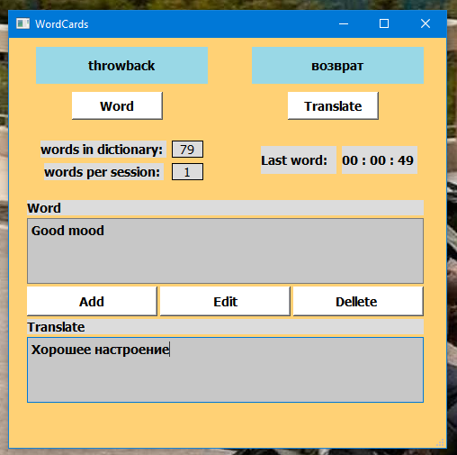

# WordCards
 
Простое приложение для изучения слов из других языков. В данном примере используется Англо-Рус. связка, однако в программе нет ограничений на вводимые языки, можно использовать любые. 

Вы вводите новые для вас слова и их перевод, они сохраняются в словаре. Нажимая кнопку Word - программа рандомно выводит вам одно из слов, если вы не можете вспомнить перевод, нажатие кнопки Translate - выводит перевод. Слово можно удалять, а также редактировать его значение. Также программа не даст вам ввести в словарь 2 одинаковых слова. 
Отображается общее кол. слов в словаре, а также количество просмотренных слов за сессию (считает нажатие кнопки Word). 
Также после каждого нажатия Word - обновляется секундомер, показывая перерыв между последним словом. 
